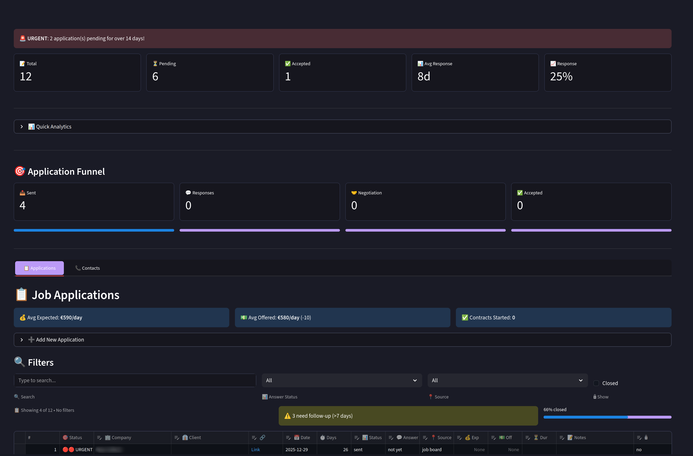

# Job Search Tracker

A self-hosted web application to track job applications and networking contacts using SQLite for data storage with automatic markdown export for viewing in neovim.

## ⚠️ Disclaimer

This application was **fully coded with AI assistance**. The user has thoroughly reviewed and guided the development process, making all architectural decisions. 

**Important notes:**
- This is a **single-user application** designed exclusively for the app owner—imperfect implementations are not problematic given this scope
- The app owner has independently verified that **data is secure and cannot be breached**, with authentication restricted to the owner only
- All security measures (OAuth configuration, email whitelist, SSL) have been reviewed and validated by the user

---



*Dashboard showing application statistics, funnel visualization, and job tracking table*

## Features

- **🔐 Google OAuth Authentication** - Secure login with Google accounts
- Track job applications with status tracking
- Manage contacts and networking connections
- View statistics (total applications, pending, accepted, refused)
- Filter and search applications
- Add/edit/delete entries through web interface
- Data stored in markdown files for easy backup and version control
- **🌐 Production-ready deployment** with nginx and systemd

## Setup

### Prerequisites

- Python 3.9 or higher
- [uv](https://github.com/astral-sh/uv) package manager

### Installation

1. Install dependencies using uv:

```bash
uv sync
```

This will create a virtual environment and install all required packages.

### Configure Google Authentication

Before running the app, set up Google OAuth:

1. Follow the steps in **[OAUTH2_SETUP.md](OAUTH2_SETUP.md)** to:
   - Create Google OAuth credentials
   - Configure `.streamlit/secrets.toml`

2. Quick setup:
```bash
# Copy the example secrets file
cp .streamlit/secrets.toml.example .streamlit/secrets.toml

# Edit and add your Google OAuth credentials
nano .streamlit/secrets.toml
```

### Running the Application

Start the Streamlit app:

```bash
uv run streamlit run app.py --server.port 8502
```

The application will open in your default browser at `http://localhost:8502`.

You'll need to log in with a Google account that's in your `allowed_emails` list.

## Production Deployment

Deploy to `candidatures.aralyra.com` with nginx, SSL, and systemd:

**📖 Full deployment guide:** [DEPLOYMENT.md](DEPLOYMENT.md)

Quick summary:
```bash
# 1. Configure Google OAuth for production domain
# 2. Set up systemd service
sudo cp job-tracker.service /etc/systemd/system/
sudo systemctl enable job-tracker
sudo systemctl start job-tracker

# 3. Configure nginx
sudo cp nginx-job-tracker.conf /etc/nginx/sites-available/job-tracker
sudo ln -s /etc/nginx/sites-available/job-tracker /etc/nginx/sites-enabled/
sudo nginx -t && sudo systemctl reload nginx

# 4. Get SSL certificate
sudo certbot --nginx -d candidatures.aralyra.com
```

Access at: **https://candidatures.aralyra.com**

## Data Architecture

The application uses **SQLite** as the backend database with automatic markdown export:

**Backend:**
- `job_tracker.db` - SQLite database (primary data store)

**Auto-Generated Markdown Files** (for viewing in neovim):
- `candidature.md` - Job applications table
- `contact.md` - Contacts table
- `VIEW.md` - Pretty formatted view with statistics

Every time you save changes in the web app, the markdown files are automatically regenerated. This gives you:
- ✅ Fast, reliable SQLite backend
- ✅ Clean markdown tables to view in neovim
- ✅ Best of both worlds!

## Usage

### Applications Tab

- View all job applications in a sortable table
- Filter by status (not yet, refused, Ok, too late)
- Search by company name
- Add new applications using the form
- Edit existing entries directly in the table
- Save changes to persist to markdown files

### Contacts Tab

- View all contacts in a table
- Add new contacts using the form
- Edit existing contacts directly in the table
- Save changes to persist to markdown files

## Project Structure

```
.
├── app.py                        # Main Streamlit application
├── models.py                     # SQLAlchemy database models
├── utils.py                      # Export utilities (markdown generation)
├── job_tracker.db                # SQLite database
├── pyproject.toml                # Project dependencies
├── candidature.md                # Auto-generated applications export
├── contact.md                    # Auto-generated contacts export
├── VIEW.md                       # Auto-generated readable view
│
├── .streamlit/
│   ├── secrets.toml.example      # OAuth config template
│   └── secrets.toml              # OAuth credentials (git-ignored)
│
├── nginx-job-tracker.conf        # Nginx reverse proxy config
├── job-tracker.service           # Systemd service file
├── DEPLOYMENT.md                 # Production deployment guide
└── OAUTH2_SETUP.md               # Google OAuth setup guide
```

## Database Schema

**contacts** (companies you apply to):
- `id`, `company`, `firstname`, `lastname`, `linkedin_link`, `phone_number`, `updated_date`

**applications** (job applications):
- `id`, `company_id` (FK → contacts.id), `client`, `job_link`, `date`, `source`, `status`, `answer`, `answer_date`, `expected_rate`, `offered_rate`, `duration`, `start_date`, `notes`, `closed`

Applications are linked to contacts via foreign key (`company_id`). When you update a company name in contacts, all linked applications automatically reflect the change.

## Security

- **Authentication:** Google OAuth 2.0
- **Access Control:** Email whitelist in `secrets.toml`
- **SSL/TLS:** Let's Encrypt certificates (production)
- **Secrets:** All credentials stored in `.streamlit/secrets.toml` (git-ignored)

See [OAUTH2_SETUP.md](OAUTH2_SETUP.md) for security best practices.

## Documentation

- **[OAUTH2_SETUP.md](OAUTH2_SETUP.md)** - Complete Google OAuth setup guide
- **[DEPLOYMENT.md](DEPLOYMENT.md)** - Production deployment guide
- **[README.md](README.md)** - This file
